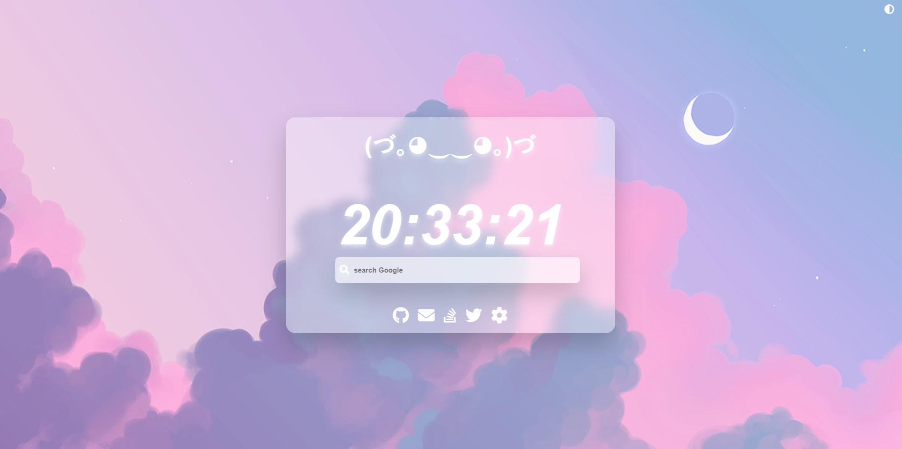
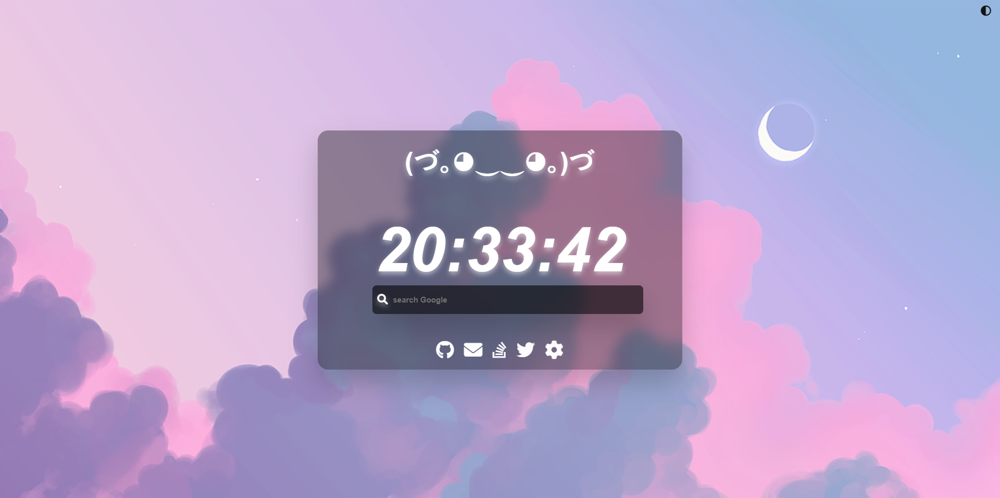

A customizable, minimal start page for web browsers

# Installation
## Chromium-based Browsers
- Download [New Tab Redirect](https://chrome.google.com/webstore/detail/new-tab-redirect/icpgjfneehieebagbmdbhnlpiopdcmna).
- Go to extension settings and set `https://gokiimax.github.io/sady/` as Redirect URL.

### Firefox-based Browsers
- Download [New Tab Override](https://addons.mozilla.org/en-US/firefox/addon/new-tab-override/).
- Go to Extension settings and set `https://gokiimax.github.io/sady/` as Redirect URL.

## Preview
### Light

  

### Dark

  

